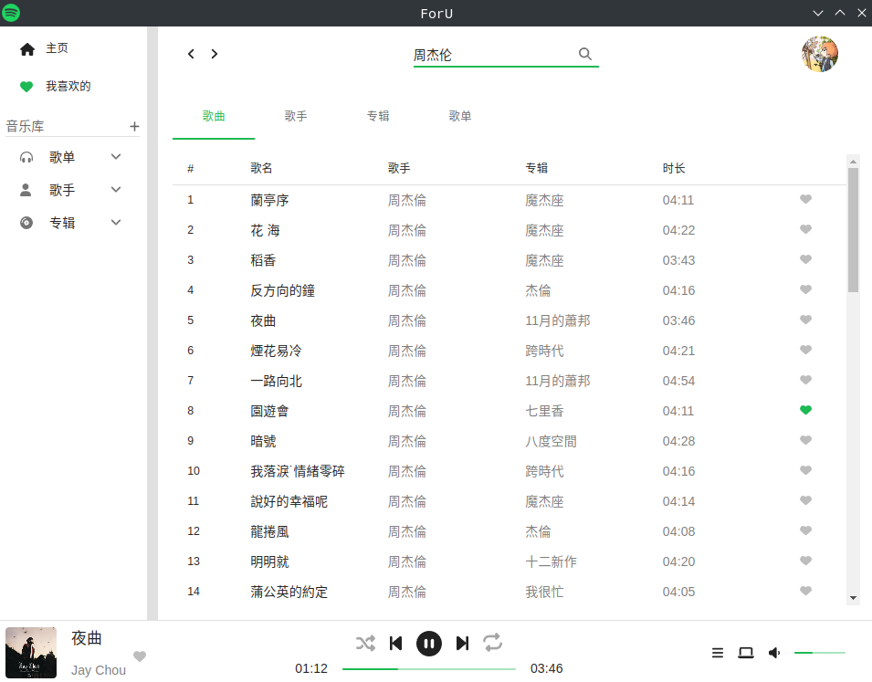

# ForU
A third party client of spotify based on Electron.

This is a learning project for React and Electron.



## Premise
1. You need a **Spotify Premium** to play songs.
2. Then you need to create an app on [Dashboard](https://developer.spotify.com/dashboard),and set "Redirect URIs" to http://localhost:12138/callback , after save you can find client id on settings page
3. paste the client id when you first launch.

## Install
Download binaries from the relese page.

For archlinux user, you can find package in AUR:
```bash
paru foru
```

## Limitation
Not available on windows so far.(may be caused by widevine license)